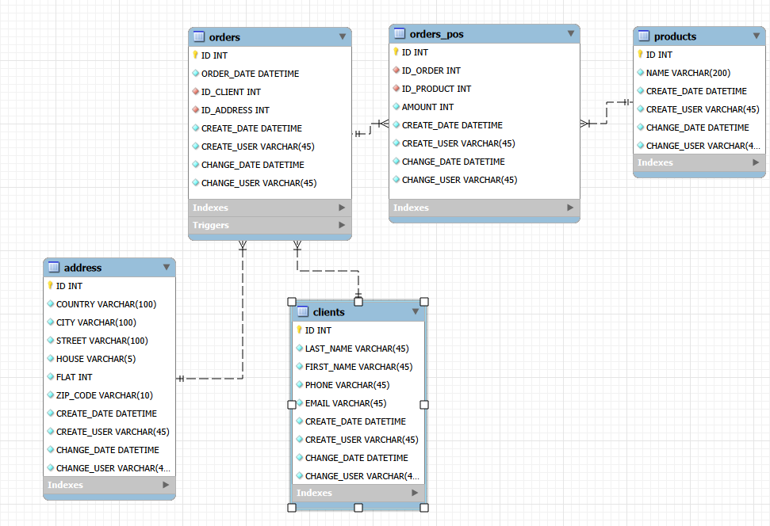
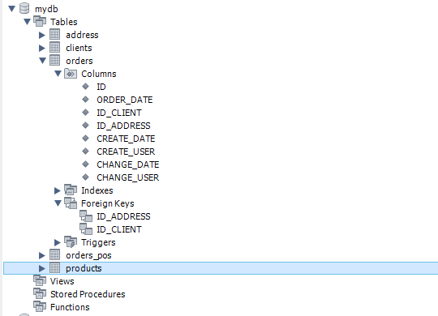
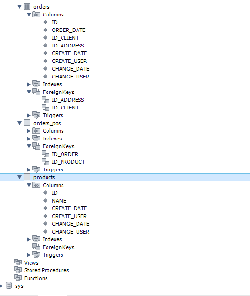

# goit-rdb-hw-02

# Проектування баз даних з використанням семантичних моделей
# Завдання:
1. Переведіть початкову таблицю в першу нормальну форму.
2. Переведіть нові таблиці в другу нормальну форму.
3. Переведіть нові таблиці в третю нормальну форму.
4. Розробіть ER-діаграму отриманих таблиць.
5. Використовуючи ER-діаграму, створіть таблиці в базі даних. Оформіть ці таблиці без конкретних значень, тільки з урахуванням колонок та їхніх зв'язків, вручну або автоматично.

---

## Оригінальні дані (ненормалізовані)

| Номер_замовлення | Назва_товару і кількість | Адреса_клієнта | Дата_замовлення | Клієнт |
|------------------|--------------------------|----------------|------------------|---------|
| 101 | Лептоп: 3, Мишка: 2 | Хрещатик 1 | 15.03.2023 | Мельник |
| 102 | Принтер: 1 | Басейна 2 | 16.03.2023 | Шевченко |
| 103 | Мишка: 4 | Комп'ютерна 3 | 17.03.2023 | Коваленко |

Порушення 1НФ: неатомарні значення, дублювання адрес і клієнтів.

---

# 1-ша нормальна форма (1NF)

| Номер_замовлення | Назва_товару | Кількість | Вулиця_клієнта | Будинок_клієнта | Дата_замовлення | Клієнт |
|------------------|--------------|-----------|----------------|------------------|------------------|----------|
| 101 | Лептоп | 3 | Хрещатик | 1 | 15.03.2023 | Мельник |
| 101 | Мишка | 2 | Хрещатик | 1 | 15.03.2023 | Мельник |
| 102 | Принтер | 1 | Басейна | 2 | 16.03.2023 | Шевченко |
| 103 | Мишка | 4 | Комп'ютерна | 3 | 17.03.2023 | Коваленко |

Усі поля атомарні — 1НФ виконана.

---

# 2-га нормальна форма (2NF)

**Таблиця `orders_2nf`**

| Номер_замовлення | Вулиця_клієнта | Будинок_клієнта | Дата_замовлення | Клієнт |
|------------------|----------------|------------------|------------------|----------|
| 101 | Хрещатик | 1 | 15.03.2023 | Мельник |
| 102 | Басейна | 2 | 16.03.2023 | Шевченко |
| 103 | Комп'ютерна | 3 | 17.03.2023 | Коваленко |

**Таблиця `order_items_2nf`**

| ID_позиції | Номер_замовлення | Назва_товару | Кількість |
|------------|-------------------|--------------|-----------|
| 101 | 101 | Лептоп | 3 |
| 102 | 101 | Мишка | 2 |
| 103 | 102 | Принтер | 1 |
| 104 | 103 | Мишка | 4 |

Часткові залежності усунуті — 2НФ виконана.

---

# 3-тя нормальна форма (3NF)

**Таблиця `orders`**

| Номер замовлення | Дата_замовлення | ID_Клієнта | ID_ADDRESS |
|----|------------------|----------|-------------|
| 101 | 15.03.2023 | 101 | 101 |
| 102 | 16.03.2023 | 102 | 102 |
| 103 | 17.03.2023 | 103 | 103 |

**Таблиця `orders_pos`**

| ID | ID_ORDER | ID_товару | Кількість |
|----|----------|--------------|-----------|
| 1 | 101 | 101 | 3 |
| 2 | 101 | 102 | 2 |
| 3 | 102 | 103 | 1 |
| 4 | 103 | 102 | 4 |

**Таблиця `address`**

| ID | Вулиця | Будинок |
|----|--------|----------|
| 101 | Хрещатик | 1 |
| 102 | Басейна | 2 |
| 103 | Комп'ютерна | 3 |

**Таблиця `products`**

| ID_товару | Назва_товару |
|----|--------|
| 101 | Лептоп |
| 102 | Мишка |
| 103 | Принтер |

**Таблиця `clients`**

| ID_Клієнта | Клієнт |
|----|--------|
| 101 | Мельник |
| 102 | Шевченко |
| 103 | Коваленко |

Транзитивні залежності усунуті.  

---
---

# 4. Розробка ER діаграми

*Перед початком визначемо сутності та перейменуємо назви колонок (атрибутів)*  
*також добавимо поля, які характеризували б зміни*

**`orders` - сутність замовлень, містить основну інформацію про замовлення**  
**Поля:**  
*ID - первинний ключ, що являється "номером замовлення" (Primary Key)*  
*ORDER_DATE - дата замовлення*  
*ID_CLIENT - ID клієнта (Foreign Key)*  
*ID_ADDRESS - ID адреси (Foreign Key)*  
*CREATE_DATE - дата час створення*  
*CREATE_USER - користовуч, що створив*  
*CHANGE_DATE - дата час зміни*  
*CHANGE_USER - користувач, що змінив*  

---

**`orders_pos` - сутність позицій замовлень (окремих товарів в замовленні)**  
**Поля:**  
*ID - первинний ключ (Primary Key)*  
*ID_ORDER - ID замовлення (Foreign Key)*  
*ID_PRODUCT - ID продукту (Foreign Key)*  
*AMOUNT - Кількість проданого товару*  
*CREATE_DATE - дата час створення*  
*CREATE_USER - користовуч, що створив*  
*CHANGE_DATE - дата час зміни*  
*CHANGE_USER - користувач, що змінив*  

---

**`address` - сутність, яка характеризує адреси замовників**  
**Поля:**  
*ID - первинний ключ (Primary Key)*  
*COUNTRY - країна замовника*  
*CITY - місто замовника*  
*STREET - вулиця замовника*  
*HOUSE - будинок замовника*  
*FLAT - квартира замовника*  
*ZIP_CODE - поштовий індекс замовника*  
*CREATE_DATE - дата час створення*  
*CREATE_USER - користовуч, що створив*  
*CHANGE_DATE - дата час зміни*  
*CHANGE_USER - користувач, що змінив*  

**Свідомо створені зайві атрибути, які не входять у завдання для своєрідного моделювання потенційних додаткових атрибутів сутності, що за собою може викликати аналіз доставки, затрати на логістику, послуги кур'єра, формування ціни та термінів тощо**

--- 

**`products` - сутність, яка характеризує товар та можливі його похідні атрибути**
**Поля:**  
*ID - первинний ключ (Primary Key)*  
*NAME - назва продукту*  
*CREATE_DATE - дата час створення*  
*CREATE_USER - користовуч, що створив*  
*CHANGE_DATE - дата час зміни*  
*CHANGE_USER - користувач, що змінив*  

---

**`clients` - сутність, яка характеризує інформацію про клієнтів, також можна розвивати логіку про наявні скидки та інші додаткові атрибути**  
**Поля:**  
*ID - первинний ключ (Primary Key)*  
*LAST_NAME - прізвище замовника*  
*FIRST_NAME - ім'я замовника*  
*PHONE - номер телефону замовника*  
*EMAIL - email замовника*  
*CREATE_DATE - дата час створення*  
*CREATE_USER - користовуч, що створив*  
*CHANGE_DATE - дата час зміни*  
*CHANGE_USER - користувач, що змінив*  

**Свідомо створені зайві атрибути, які не входять у завдання для своєрідного моделювання потенційних додаткових атрибутів сутності**

---

  

*тригери та індекси поки що не використовував*  

---

# 5. Створення таблиць в db через EER діаграми

Всі 5 таблиць були успішно створені.